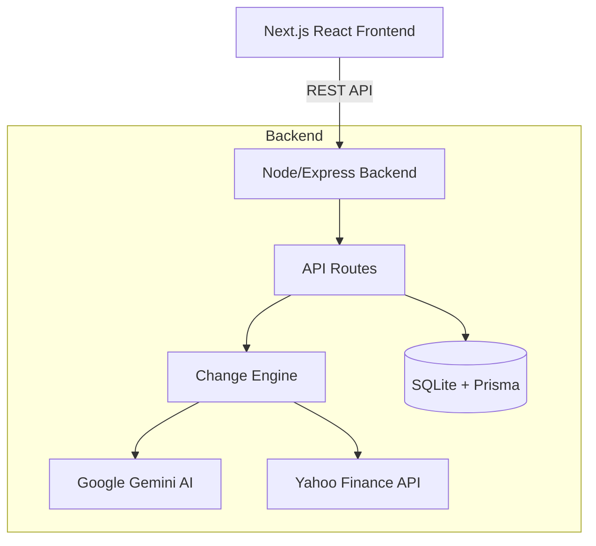

# Smart Market Watchlist - Groww CODE 2026


A market tracking application designed to help users quickly understand what has "meaningfully changed" since they last checked, ensuring their attention is directed exactly where it matters most.

## 🚀 Overview

Traditional watchlists are static—they show you the current price and a red or green number, leaving the user to figure out if that number is actually important. 

I built the **Smart Market Watchlist** to flip this paradigm. It acts as an intelligent assistant that watches the market while you are away, filtering out the noise of normal trading activity and highlighting only the anomalies, significant shifts, and contextually relevant changes.

## ✨ Core Features & Implementation

### 1. Return Digest Overlay
- **What I built:** A dynamic, full-screen summary that greets users when they return to the app after being away for more than an hour.
- **How I made it:** Used a React `useEffect` hook to calculate the difference between the current time and the `lastSeenTimestamp` of the most recent alert. Managed state in `localStorage` (`lastDigestShown`) so it only triggers once per session.
- **Edge cases considered:** 
  - Prevents annoying the user on every tab switch by enforcing a 1-hour cooldown.
  - Ensures the digest *only* shows if there are actually items requiring attention (no empty, useless digests).
  - Added a slight mount delay to ensure smooth CSS transition animations without flashing on initial load.

### 2. Dynamic Sensitivity Engine
- **What I built:** A user-configurable noise filter (Calm, Watchful, Vigilant) to adjust how often alerts are triggered.
- **How I made it:** Built a deterministic scoring backend in `changeEngine.ts` that dynamically adjusts score multipliers and thresholds based on a `?sensitivity=` query parameter passed from the frontend.
- **Edge cases considered:** 
  - Different users have different risk appetites (day traders vs. long-term investors).
  - Ensured state persists across browser reloads via `localStorage`.
  - Backend gracefully handles invalid sensitivity values by falling back to the default "Watchful" mode.

### 3. Sector Correlation Context
- **What I built:** A UI card that analyzes a stock's movement relative to its sector peers in your watchlist, identifying if a price drop is a "Company-Specific Move" or a "Sector-Wide Decline."
- **How I made it:** Built a `GET /sector-context` endpoint that queries the database for all other watchlist stocks matching the target's `sector`. It calculates average sector movement to assign specific insight flags.
- **Edge cases considered:** 
  - What happens if a user only has one stock in a specific sector? The backend returns an empty peer array, and the UI handles this by simply not rendering the card rather than showing broken UI.
  - Handled missing sector metadata gracefully if the upstream API fails to provide it.

### 4. Change History Timeline
- **What I built:** A dedicated timeline in the side panel showing a history of when a stock was flagged, its anomaly score, and severity.
- **How I made it:** Created a new SQLite table mapped via Prisma to store `ChangeHistoryEvent`. Exposed via a `GET /history` endpoint and rendered as a vertical timeline.
- **Edge cases considered:** 
  - Limited the backend payload to the 10 most recent events to prevent massive JSON payloads and UI lag.
  - Gracefully handles newly added stocks that have no history yet.

### 5. Live Stock Search Preview
- **What I built:** Real-time price quotes appear in a polished card while you type in the "Add stocks" input, before you even hit enter.
- **How I made it:** Implemented a 500ms debounced React `useEffect` that calls the `/live` Yahoo Finance wrapper endpoint while the user types.
- **Edge cases considered:** 
  - Throttling API calls via debouncing to prevent aggressive rate-limiting from the upstream market data provider.
  - Handled invalid ticker symbols gracefully by clearing the preview without throwing raw JavaScript errors to the user.

### 6. Hybrid AI & Deterministic Scoring
- **What I built:** A scoring pipeline that evaluates price movements, volume spikes, and 52-week ranges, triggering an AI brief for extreme anomalies.
- **How I made it:** Calculates Z-scores deterministically. If a score exceeds the threshold, it triggers the Google Gemini 1.5 API to write a brief human-readable summary.
- **Edge cases considered:** 
  - AI APIs can timeout, fail, or run out of quota. Built a strict fallback mechanism where if Gemini fails (or if the API key is missing), the system instantly falls back to a deterministic string generator without breaking the UI or failing the request.

---

## 🏗️ Architecture

The project follows a decoupled client-server architecture.


## 📐 Architecture highlights
- **Centralized Database Instance:** Uses a singleton Prisma client to prevent connection exhaustion during hot-reloads.
- **Robust Error Handling:** Express 5's native promise rejection handling combined with custom error wrappers ensures the server never crashes on bad API data.
- **Stateless Scoring Engine:** The `changeEngine.ts` computes "Meaningful Change Scores" deterministically on the fly, ensuring fast response times without database bloat.

  
## 🛠️ Tech Stack

### Frontend
- **Framework:** Next.js (App Router), React 18
- **Styling:** Tailwind CSS (Vanilla, highly customized design system)
- **Icons:** Lucide React
- **State Management:** React Hooks + LocalStorage for persistence

### Backend
- **Runtime:** Node.js + Express 5
- **Language:** TypeScript
- **Database:** SQLite (via Prisma ORM) for localized, fast data persistence
- **External APIs:** Yahoo Finance (via `yahoo-finance2` for live market data)
- **AI Integration:** Google GenAI SDK (Gemini 1.5)

## ⚙️ Getting Started

### Prerequisites
- Node.js (v18 or higher)
- npm or yarn

### 1. Clone the repository
```bash
git clone https://github.com/Aayushi-raj/Smart-Watchlist-CodeByGroww.git
cd Smart-Watchlist-CodeByGroww
```

### 2. Backend Setup
```bash
cd backend
npm install

# Set up environment variables
cp .env.example .env
# Edit .env and add your GEMINI_API_KEY (if available, otherwise it falls back to the deterministic engine)

# Initialize the SQLite database
npx prisma db push

# Start the backend server (runs on http://localhost:5000)
npm run dev
```

### 3. Frontend Setup
Open a new terminal window:
```bash
cd frontend
npm install

# Start the frontend server (runs on http://localhost:3000)
npm run dev
```

### OUTPUT


---
*Built with ❤️ for Groww CODE 2026*
